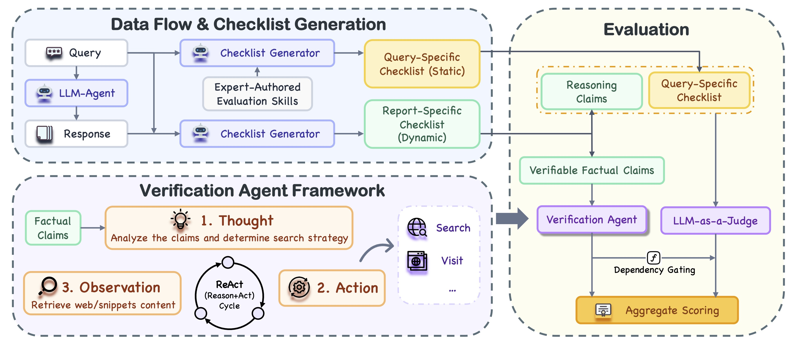

<div align="center">

# JADE: Expert-Grounded Dynamic Evaluation for Open-Ended Professional Tasks

[](https://openreview.net/forum?id=SoilRyCv1i)
[](https://arxiv.org/abs/2602.06486)
[](https://openreview.net/forum?id=SoilRyCv1i)
[](https://www.python.org/)

[**[English](README.md)**] | [**中文版**]

</div>

> 🎉 **新闻**：JADE 已被 **ICML 2026** 接收！欢迎查阅 [OpenReview](https://openreview.net/forum?id=SoilRyCv1i) 或 [arXiv](https://arxiv.org/abs/2602.06486) 上的论文。

JADE 是一个创新的双层评估框架，专门用于评估 Agent 在复杂的开放式专业任务（如市场研究、策略采购）上的表现。它通过将通用的专家原则与具体的证据验证解耦，有效处理了评估中的"稳定性-自适应性"难题。

---

## 🖼️ JADE 框架概览


在给定用户 Query 和 Agent 生成的 Response 后，JADE 首先会激活相应的 Expert-Authored Skills，以指导生成 Query-Specific Checklists。随后，它会针对可验证的 Factual Claims 和 Reasoning Quality 推导出 Report-Specific Checklists。其中，Factual Claims 通过实时网页验证进行核实，而推理部分则由 LLM 以 Query-Specific Checklists 为条件进行评估。此外，该过程还引入了基于证据的门控机制，以确保未获得验证的事实会使其相关的依赖性判断失效。

---

## 📊 BizBench 排行榜

JADE 评估不同模型和 Agent 在 BizBench 上的表现。

| Model | Type | Tool | Final (%) | Reasoning (%) | Evidence (%) | Credibility (%) | Density | Tokens |
| :--- | :---: | :---: | :---: | :---: | :---: | :---: | :---: | :---: |
| _**Agentic Deep Research Systems**_ | | | | | | | | |
| Gemini Deep Research | Prop. | ✓ | **57.1** | **63.4** | 89.1 | 43.8 | 0.063 | 7590 |
| Shopping Research | Prop. | ✓ | 56.2 | 59.1 | **95.3** | 44.4 | 0.067 | 4772 |
| o4-mini Deep Research | Prop. | ✓ | 47.7 | 54.5 | 87.6 | 41.2 | 0.061 | 2907 |
| ChatGPT (Web Search) | Prop. | ✓ | 38.8 | 46.0 | 84.6 | 48.6 | 0.051 | 2244 |
| _**API-Based Models with Tool Use**_ | | | | | | | | |
| GPT-5.2 | Prop. | ✓ | 55.7 | 59.2 | 93.5 | **50.2** | **0.071** | 3167 |
| DeepSeek V3.2 | Open | ✓ | 55.8 | 59.2 | 93.5 | 48.1 | 0.071 | 2877 |
| Gemini 3 Pro | Prop. | ✓ | 41.8 | 48.5 | 86.5 | 44.7 | 0.059 | 1419 |
| Claude Opus 4.5 | Prop. | ✓ | 36.2 | 45.8 | 80.2 | 44.8 | 0.049 | 1824 |
| Claude Sonnet 4.5 | Prop. | ✓ | 32.9 | 45.5 | 73.3 | 48.1 | 0.046 | 1975 |
| Qwen3-Max | Open | ✓ | 34.0 | 39.9 | 83.8 | 45.5 | 0.047 | 1340 |
| GPT-4.1 | Prop. | ✓ | 32.7 | 40.2 | 81.4 | 45.7 | 0.046 | 1434 |
| _**API-Based Models (No Tool)**_ | | | | | | | | |
| GPT-5.2 | Prop. | – | 49.0 | 52.6 | 93.1 | **53.7** | 0.064 | 2516 |
| DeepSeek V3.2 | Open | – | 46.1 | 50.7 | 90.9 | 52.1 | 0.061 | 2299 |
| Gemini 3 Pro | Prop. | – | 44.8 | 52.7 | 84.8 | 50.7 | 0.063 | 1495 |
| GPT-4.1 | Prop. | – | 42.7 | 54.6 | 80.0 | 51.2 | 0.060 | 1380 |
| Qwen3-Max | Open | – | 34.2 | 46.0 | 74.0 | 50.9 | 0.051 | 1040 |
| Claude Opus 4.5 | Prop. | – | 32.1 | 49.3 | 68.0 | 52.2 | 0.044 | 2314 |
| Claude Sonnet 4.5 | Prop. | – | 29.1 | 41.8 | 71.6 | 52.2 | 0.041 | 1585 |

---

## 🌟 核心特性

* **双层分解架构**：第一层（Layer 1）将专家知识编码为稳定的评估技能；第二层（Layer 2）针对具体报告动态生成断言级检查点。
* **证据感知门控**：一种独特的机制，如果底层事实被判定为幻觉或错误，基于该事实推导出的后续逻辑结论将自动失效。
* **实时联网验证**：集成验证代理（Verification Agent），通过实时网页搜索核实数据、价格、证书及定量描述的真实性。
* **BizBench 基准测试**：包含 150 个源自真实 B2B 场景的高质量战略采购 Query，具有高度的现实意义，具体详见 `bizbench.json`。

---

## 🛠️ 安装指南

```bash
# python version >= 3.10

git clone https://github.com/smiling-world/JADE.git
# or 'git clone git@github.com:smiling-world/JADE.git'
# or download the zip file and unzip
cd JADE
pip install -r requirements.txt
```

---

## 🚀 快速上手

按照以下四个步骤，快速开始使用 JADE 评估您的 Agent 报告：

### 1. 配置环境变量

首先，克隆环境配置文件模板并填写您的 API 密钥（其中 `OPENROUTER_API_KEY`、`SERPAPI_KEY` 和 `JINA_API_KEY` 基本很少用到，甚至可以不填）。

```bash
cp env.example .env
```

### 2. 准备待评估数据

将 Agent 生成的报告填入数据输入模板中的 `report` 属性中。

模板路径: `data/input/base_template.json`

💡 **提示**：您可以填入若干报告内容，然后采用下述两种方法中的一种来进行少量测试：

1. 在 `base_template.json` 中删除其他未填写的 sample。
2. 在 `configs/bizbench_eval.yaml` 中设置 `item_ids` 属性来实现仅评估部分 sample。

### 3. 运行评估脚本

```bash
python scripts/run_jade.py --config configs/bizbench_eval.yaml
```

### 4. 查看评估结果

结果默认保存在 `output/base_template` 中，如果您需要修改输出目录，可以采用下述方式中的一种：

1. 修改 `configs/bizbench_eval.yaml` 中的 `output_dir` 属性。
2. 通过命令行参数指定输出目录：

```bash
python scripts/run_jade.py --config configs/bizbench_eval.yaml \
    --output_dir output/base_template
```

---

## 👀 更多自定义探索

1. 您可以不局限于 `bizbench` 的问题以及我们给定的分类标准，您可以自己根据不同领域内的问题设定分类标准，并按照 `rubrics/bizbench` 中的格式生成每个类别的专家经验文件，然后修改 `configs/bizbench_eval.yaml` 中的 `rubric_dir` 路径。
2. 您可以通过修改 `configs/bizbench_eval.yaml` 中的 `use_skill` 和 `use_report_specific` 属性来探索双层结构在 JADE 中的不同表现。同时也可以尝试修改 `configs/bizbench_eval.yaml` 中的 `score_fusion_mode`、`reasoning_weight`、`evidence_weight` 和 `credibility_weight` 来探索权重对最终得分的影响。

---

## 📖 引用

如果 JADE 或 BizBench 对您的研究有帮助，欢迎引用我们的论文：

```bibtex
@inproceedings{
lin2026jade,
title={{JADE}: Expert-Grounded Dynamic Evaluation for Open-Ended Professional Tasks},
author={Lanbo Lin and Jiayao Liu and Tianyuan Yang and Li Cai and Yuanwu Xu and Lei Wei and Sicong Xie and Guannan Zhang},
booktitle={Forty-third International Conference on Machine Learning},
year={2026},
url={https://openreview.net/forum?id=SoilRyCv1i}
}
```
